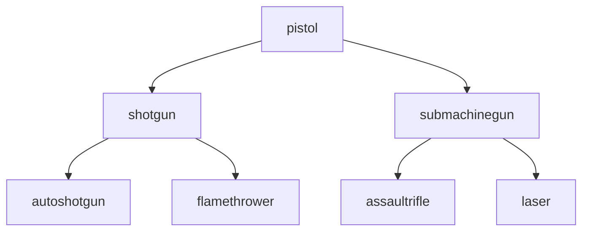

# ECS Vampire Survivor Factory Game

This is a vampire survivors clone as a factorio/mindustry game.

## Gameplay

The player can move, shoot, has a collection radius, and can build machines. Difficulty will scale based on time spent in a chunk, as well as amount of machinery in a chunk. The general difficulty will scale over gameplay time, to ensure that the player cannot win by running around. I want the player to feel like they have to prioritize which specific resource sites to defend. 

There will be "filters" at specific time increments that ensure a player must be technologically advanced in order to surpass a time barrier. Some may require materials for turrets that can do specific damage types (a-la camo or lead balloons in BTD)

### UI

The ui will have important information such as the current weapon, resources, and a map. There will also be pointers to important locations such as beacons, damage warnings, upgrades, unused resource sites, etc. The pointers will get smaller when farther away, until a threshold when they will no longer be displayed.

### Movement

The player can move in the 4 cardinal directions. The player can also teleport to locations on the map that have teleportation beacons.

### Shooting

The player has a shootable weapon with variants and upgrades for each variant.

This is an example upgrade tree:

each gun would have similar upgrades:

name | stats
--- | ---
fire rate | 10% fire rate
damage | 10% damage
crit rate | 1% crit rate
crit damage | 20% crit damage

and their ultimate upgrade:

gun | upgrade
--- | ---
pistol | explosive bullets
shotgun | double pellets
autoshotgun | double pellets
flamethrower | slow flames
submachinegun | explosive bullets
assaultrifle | penetrating bullets
laser | killed enemies explode

players also have upgrades such as:

name |
--- |
health + 10
speed + 10%
construction speed + 10%

The player has to (craft/find and unlock in the world) upgrades.

### Collection

The player can collect machine parts of various tiers by getting close to machine parts. These go in the players' inventory. 

### Machines

There are several types of machines that the player can build on a grid. Machines will take up a set amount of grid squares. Each machine will have input(s) and outputs. Some machines must be built on resource nodes.

There are transportation machines, such as belts, overflow/underflow/router busses, and passthru busses. These belts have a direction of travel that will send items moved onto them in that direction. All of these have a limited carrying capacity that will disallow further items from being moved onto the belt. There will be several tiers of belts, but the busses' tier will depend on its input belts.

Defense machines such as turrets and walls will be able to be resupplied by ammo (depending on tier, it will be machine parts. Has a small collection radius.) These have different tiers, which require different machine parts to build. Turrets will come in 2 flavors, AOE and single target.

Utility machines such as collectors, containers, factories and teleportation beacons.
Factories can break down machine parts to lower tier ones at a loss, or upgrade machine parts using many lower tier ones. Collectors vacuum specific resources and can output them to adjacent belts. Containers are essentially high-storage-capacity belts. Teleportation beacons are beacons that are clickable on the map that teleport the player to them. These require resources in order to be active. Note that these are one-way targets of teleportation.
